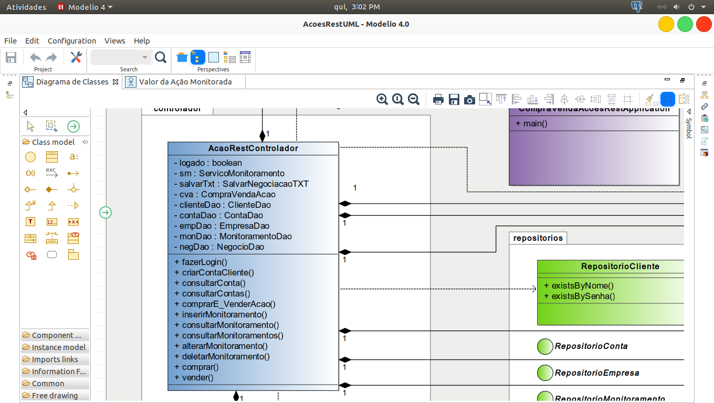

# Para executar o projeto no Eclipse ou no STS, abra o arquvio: CompraVendaAcoesRestApplication que contém o método main e clique com o botão direito do mouse
#, escolha Run As -> Java Application ou usando o terminal ou prompt de comandos: usando o comando de execução do Maven:
# mvnw spring-boot:run para o Windows ou ./mvnw spring-boot:run para o Linux, não se esqueça de trocar: usuário e senha
# do PostgreSQL e também alterar o E-mail e senha para o envio de notificações; para altera - los vá para o arquivo: application.properties.

 
 
  
  
 
 
 
 
  
 
# Exemplo de execução pelo terminal do Linux.
 

 

# Projeto UML e código fonte:
 

 
 
 # Abaixo a classe: AcoesRestControlador.java em UML.
  
 
 
  
 
 # Código fonte de AcoesRestControlador.java
  
 
 
  
 
 # Pasta do projeto onde está o projeto UML.
  
 
 
 
  
 

